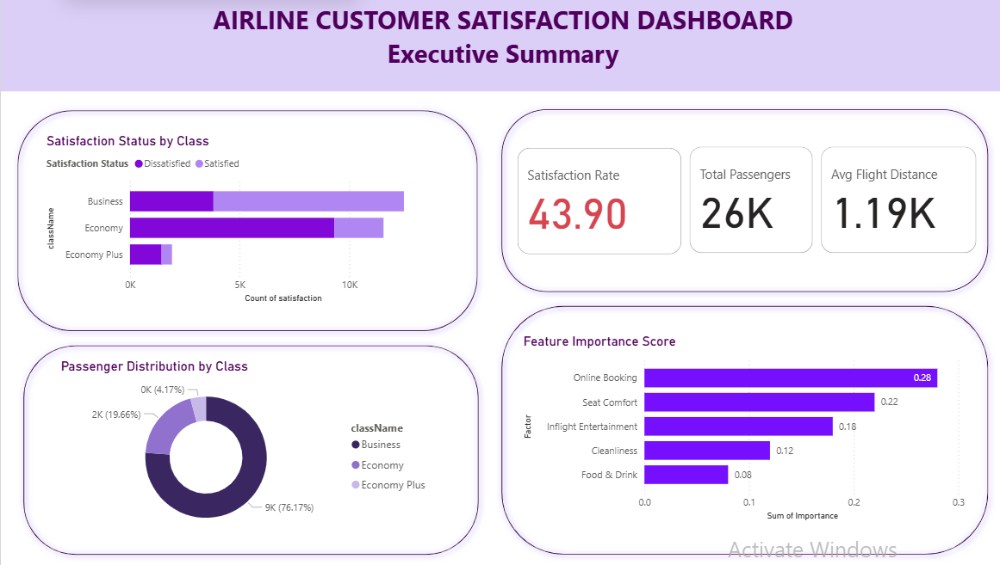
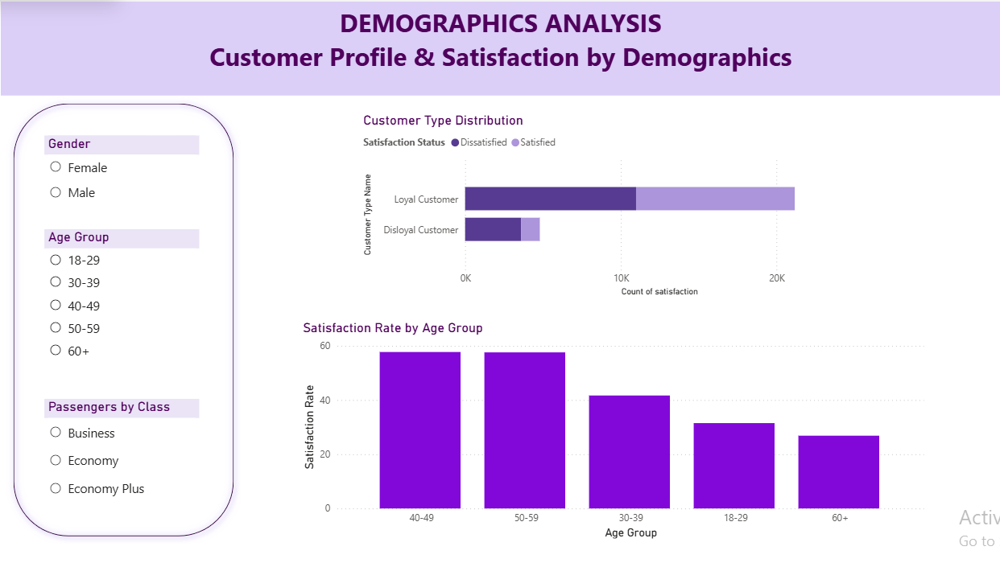
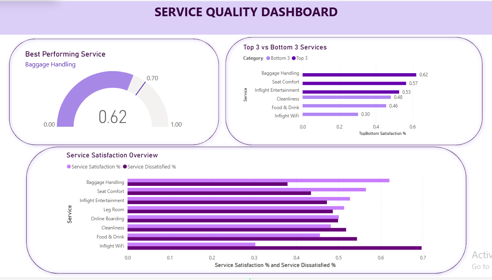
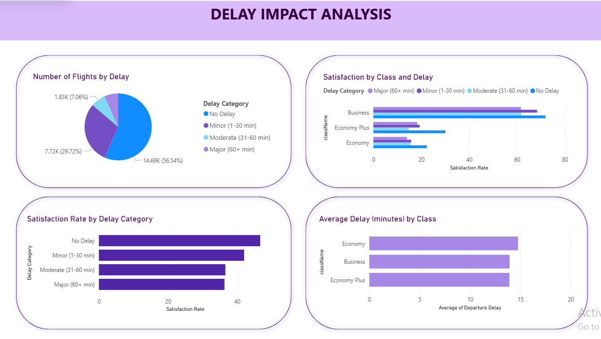

# ✈️ Airline Customer Satisfaction Predictor

A **Machine Learning web application** that predicts airline passenger satisfaction in real time and provides **business insights using Power BI dashboards and SQL analysis**.

---

## 🌐 Live Demo

🔗 **Hugging Face App**  
https://huggingface.co/spaces/SamadhiDBS/airline-satisfaction-predictor

💻 **GitHub Repository**  
https://github.com/SamadhiDBS/Airline-satisfaction-analysis

## 📊 Dashboard Preview






---

## 🏷️ Tech Stack


---

## 📊 Project Overview

| Metric | Value |
|------|------|
| Dataset | 25,976 passengers |
| Model Accuracy | 95% |
| Satisfaction Rate | 43.9% |
| Dissatisfied Passengers | 56.1% |

---

## 🎯 Project Objectives

- Predict airline passenger satisfaction  
- Identify key factors affecting customer experience  
- Provide data-driven insights using dashboards  
- Help airlines improve customer service quality  

---

## 🚀 Application Features

- Enter passenger information and service ratings  
- Get **instant satisfaction prediction**  
- View **confidence score of prediction**  
- Identify **important factors influencing satisfaction**

---

## 📊 Power BI Dashboard

The dashboard contains **4 analytical pages**:

| Page | Description |
|-----|-------------|
| Page 1 | Overall KPIs and satisfaction by class |
| Page 2 | Passenger demographics (Age, Gender, Customer Type) |
| Page 3 | Service quality ratings analysis |
| Page 4 | Flight delays vs satisfaction impact |

---

## 🔍 Key Business Insights

1. **Poor WiFi service** is a major dissatisfaction factor.  
2. **Economy class passengers** show the lowest satisfaction rates.  
3. **Flight delays** significantly reduce customer satisfaction.

---

## 🛠️ Technologies Used

- **Machine Learning:** Random Forest Classifier  
- **Programming:** Python  
- **Web Application:** Flask + HTML/CSS  
- **Dashboard:** Power BI  
- **Database:** SQL / PostgreSQL  
- **Deployment:** Hugging Face Spaces  

---


## ⚙️ How to Run the Project

```bash
git clone https://github.com/SamadhiDBS/airline-satisfaction-project

cd airline-satisfaction-project/Flask\ App

pip install -r requirements.txt

python app.py
```

---

## 🤝 Connect With Me

💼 **LinkedIn**  
https://www.linkedin.com/in/sithumi-samadhi-0746b6292

💻 **GitHub**  
https://github.com/SamadhiDBS

---

⭐ **If you find this project useful, consider giving it a star!**
